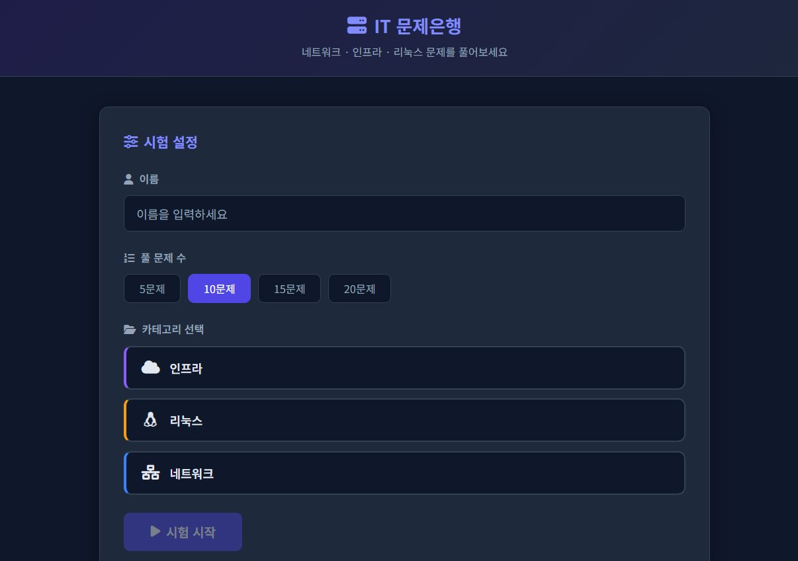
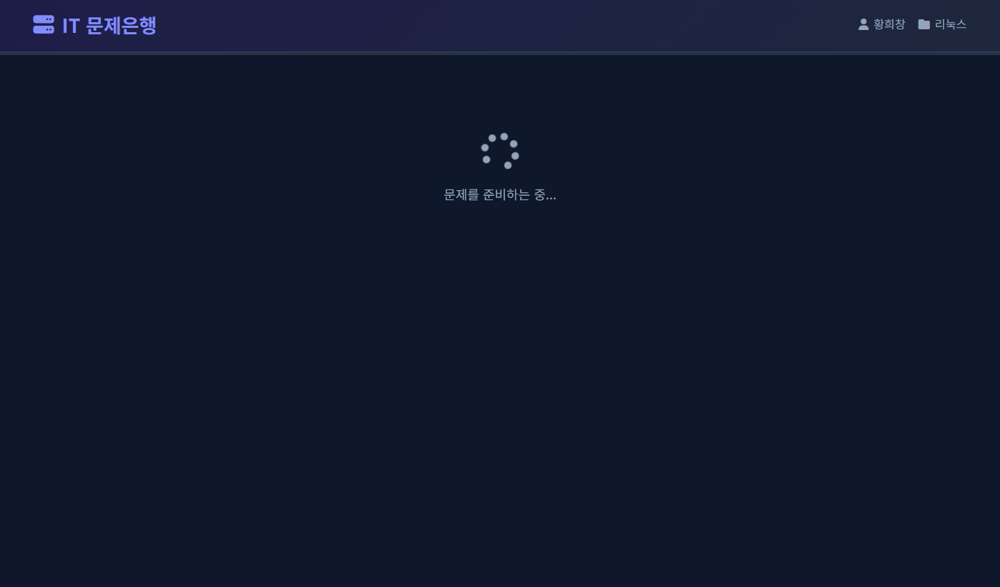
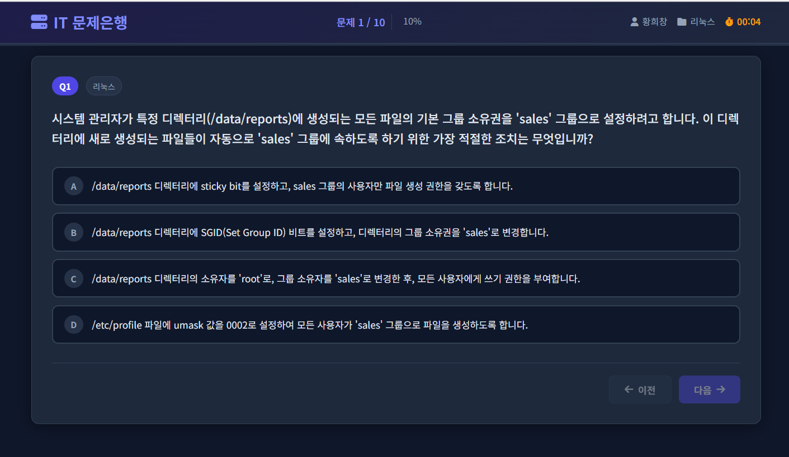
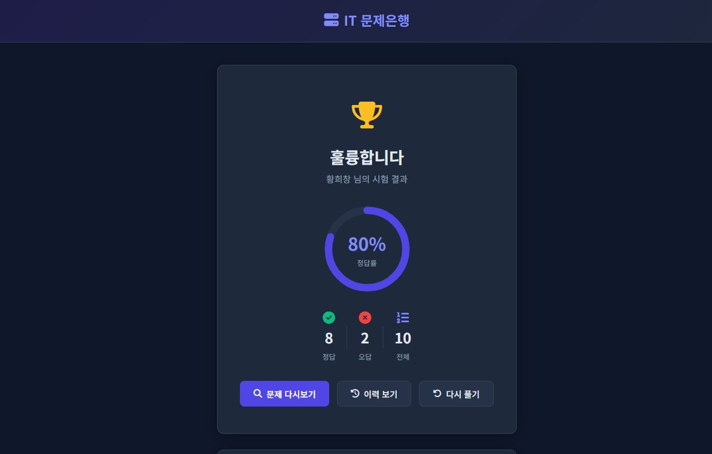
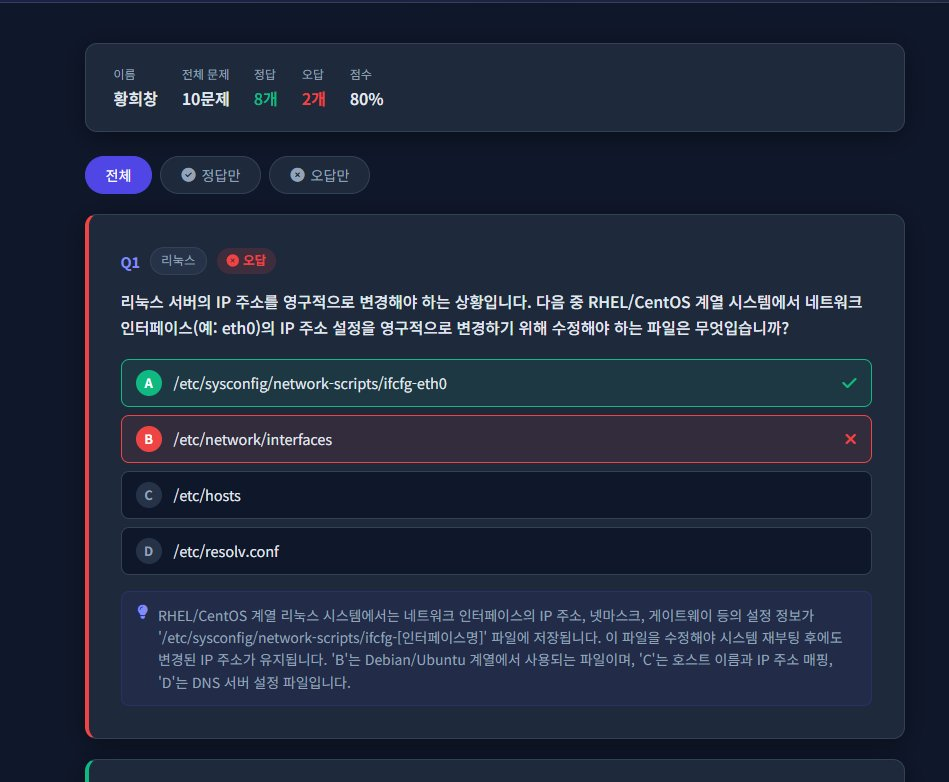
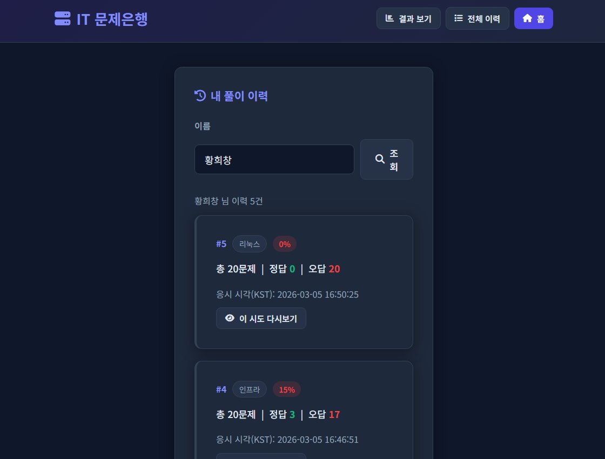
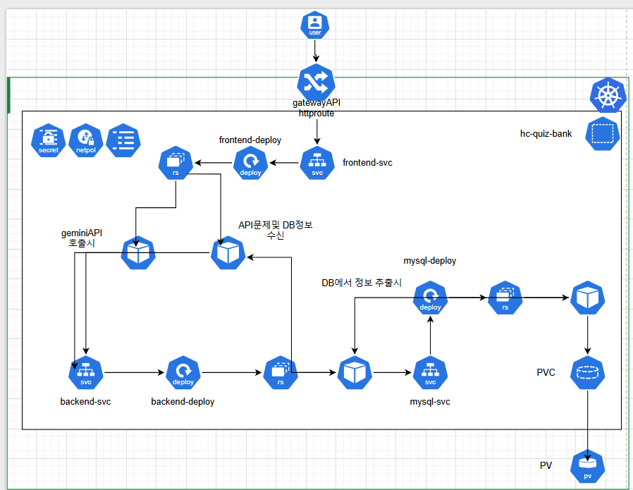

# IT-Qbank (IT 문제은행)

Flask + MySQL 기반의 IT 퀴즈 서비스입니다.  
카테고리별 객관식 문제를 AI(Gemini) + DB 하이브리드 방식으로 출제하고, 사용자별 이력과 상세 리뷰를 제공합니다.

## 핵심 기능

- 카테고리: `network`, `infra`, `linux`
- 문제 수 선택: `5 / 10 / 15 / 20`
- AI 우선 출제 + DB 보강: 부족 시 자동 생성/저장
- 사용자 최근 풀이 문제 해시(`question_hash`) 기반 중복 회피
- 한글 우선 문제 생성/표시
- 사용자별 시도 이력 저장 + 이력 항목별 다시보기

---

## 화면 흐름

서비스 이용 순서에 따른 실제 화면 예시입니다.

### ① 시험 설정

이름 입력 → 문제 수(5/10/15/20) 선택 → 카테고리 선택(인프라/리눅스/네트워크) → **시험 시작** 클릭



---

### ② AI 문제 생성 중 (로딩)

> ⏳ 시험 시작을 누르면 AI가 문제를 생성합니다. 카테고리와 문제 수에 따라 수십 초가 소요될 수 있습니다.  
> DB에 충분한 문제가 있으면 즉시 시작되고, 부족하면 AI 생성 후 자동 보강합니다.



---

### ③ 퀴즈 진행

상단 진행 바에서 현재 문제 번호(`문제 1 / 10`)와 진행률(`10%`)을 확인하며 풀 수 있습니다.  
이전/다음 버튼으로 문제를 이동합니다.



---

### ④ 시험 결과

제출 후 정답률(%), 정답 수 / 오답 수 / 전체 문제 수를 원형 차트와 함께 표시합니다.  
**문제 다시보기**, **이력 보기**, **다시 풀기** 버튼을 제공합니다.



---

### ⑤ 문제 다시보기 (리뷰)

각 문제별로 내가 선택한 보기와 정답을 색상으로 구분(초록=정답, 빨강=오답)하여 표시합니다.  
문제 하단에 해설도 함께 제공합니다. **전체 / 정답만 / 오답만** 필터 가능합니다.



---

### ⑥ 내 풀이 이력

이름으로 조회하면 시도 횟수, 카테고리, 문제 수, 정답/오답 수, 점수, 응시 시각(KST)을 확인할 수 있습니다.  
각 시도의 **이 시도 다시보기** 버튼으로 해당 풀이의 리뷰 화면으로 이동합니다.



---

## 프로젝트 구조

```text
IT-Qbank/
├─ backend/           # Flask API 서버 (문제 생성/채점/이력)
│  ├─ app.py          # 메인 API 애플리케이션
│  ├─ init_db.py      # DB 초기화 및 시드 데이터 삽입
│  ├─ requirements.txt
│  ├─ Dockerfile
│  └─ entrypoint.sh
├─ frontend/          # Flask 프론트엔드 서버 (HTML 렌더링/프록시)
│  ├─ app.py          # 페이지 라우팅 및 백엔드 프록시
│  ├─ templates/      # HTML 템플릿 (index/quiz/result/review/history)
│  ├─ static/css/     # 스타일시트
│  ├─ requirements.txt
│  ├─ Dockerfile
│  └─ entrypoint.sh
├─ db/                # MySQL 커스텀 이미지 (문자셋 설정)
├─ mysql/             # MySQL 설정 파일
├─ docs/images/       # README용 스크린샷
├─ k8s/               # Kubernetes 매니페스트
│  ├─ examples/       # ConfigMap/Secret 예시 파일
│  └─ *.yaml
├─ docker-compose.yml # 로컬 Docker 실행 설정
├─ .env.example       # 환경 변수 템플릿
├─ README.md
└─ QuickStartGuide.md
```

---

## Kubernetes 배포 다이어그램



## Kubernetes 기본값

- Namespace: `hc-quiz-bank`
- Gateway: `quiz-gateway` + `quiz-route`
- Gateway 경로: `/api → backend`, `/ → frontend`
- 프론트 서비스: `NodePort` (`30080`)

## Kubernetes 설정 파일 (예시)

- ConfigMap 예시: [configmap.example.yaml](k8s/examples/configmap.example.yaml)
- Secret 예시: [secret.example.yaml](k8s/examples/secret.example.yaml)
- 실제 적용 전 `REPLACE_*` 값을 반드시 변경하세요.

---

## API Path 동작 방식

- 경로 매칭은 `Gateway/Ingress` 규칙이 판단합니다.
- 브라우저가 페이지를 열 때는 `frontend-svc`로 라우팅됩니다.
- 문제 조회/채점/이력 조회 등 데이터 요청 시 프론트가 `/api/*`를 호출하고, 이 요청은 `backend-svc`로 라우팅됩니다.

---

## 환경 변수

`.env.example`을 복사해 `.env`를 생성하세요.

주요 변수:

| 변수명 | 설명 |
|--------|------|
| `DB_HOST`, `DB_PORT`, `DB_NAME` | MySQL 접속 정보 |
| `DB_USER`, `DB_PASSWORD` | MySQL 인증 정보 |
| `GEMINI_API_KEY` | Google Gemini API 키 |
| `GEMINI_MODEL` | 사용할 Gemini 모델명 (예: `gemini-2.5-flash`) |
| `GEMINI_API_URL` | Gemini API 엔드포인트 URL |
| `GEMINI_TIMEOUT` | AI 요청 타임아웃 (초) |
| `USE_SQLITE_FALLBACK` | MySQL 연결 실패 시 SQLite 대체 여부 |
| `BACKEND_URL` | 프론트엔드가 백엔드를 호출할 URL |
| `FRONTEND_PROXY_TIMEOUT` | 프론트 → 백엔드 프록시 타임아웃 (초) |
| `FLASK_DEBUG` | Flask 디버그 모드 활성화 여부 |

---

## 실행 (Docker)

```bash
cd IT-Qbank
copy .env.example .env   # .env에서 GEMINI_API_KEY 입력 후 저장

docker compose up -d --build
```

접속:
- 프론트: `http://localhost:8080`
- 백엔드 헬스: `http://localhost:5000/api/health`

종료:
```bash
docker compose down
```

---

## 주요 API

| 메서드 | 경로 | 설명 |
|--------|------|------|
| `GET` | `/api/health` | 백엔드 헬스 체크 |
| `GET` | `/api/categories` | 카테고리 목록 조회 |
| `GET` | `/api/questions/<category>` | 문제 출제 (`limit`, `shuffle`, `source`, `user` 파라미터) |
| `GET` | `/api/questions/<category>/all` | 카테고리 전체 문제 조회 |
| `POST` | `/api/submit` | 답안 제출 및 채점 |
| `GET` | `/api/history/<user_name>` | 사용자 풀이 이력 목록 |
| `GET` | `/api/history/<user_name>/<attempt_id>` | 특정 시도 상세 조회 |
| `GET` | `/api/ai/health` | AI(Gemini) 연결 상태 확인 |
| `POST` | `/api/ai/questions` | AI 문제 직접 생성 요청 |

---

## DB 확인 (한글 깨짐 대응)

```bash
chcp 65001
mysql -h localhost -P 3306 -u quizuser -p --default-character-set=utf8mb4 quizdb
```

```sql
SET NAMES utf8mb4;
SELECT id, category, LEFT(question, 80) AS q, created_at
FROM questions
ORDER BY id DESC
LIMIT 10;
```

---

## 최근 반영 사항

- Gemini 모델 업데이트: `gemini-2.5-flash` 적용
- 20문제 생성 지원: `maxOutputTokens 16384`, `batch_size` 최대 20
- 초기 DB 시드: 애플리케이션 기동 시 인프라 문제 자동 삽입
- 사용자별 최근 풀이 문제 해시 제외 로직 적용
- 이력 페이지에서 선택한 시도를 리뷰 화면으로 재조회 가능
- KST 기준 시각 저장/응답(`created_at_kst`) 정리
