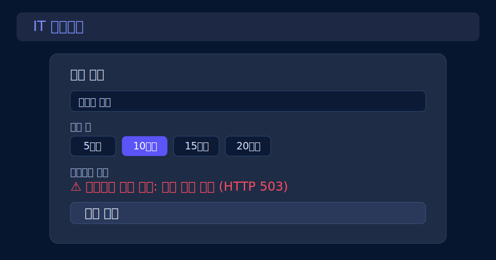
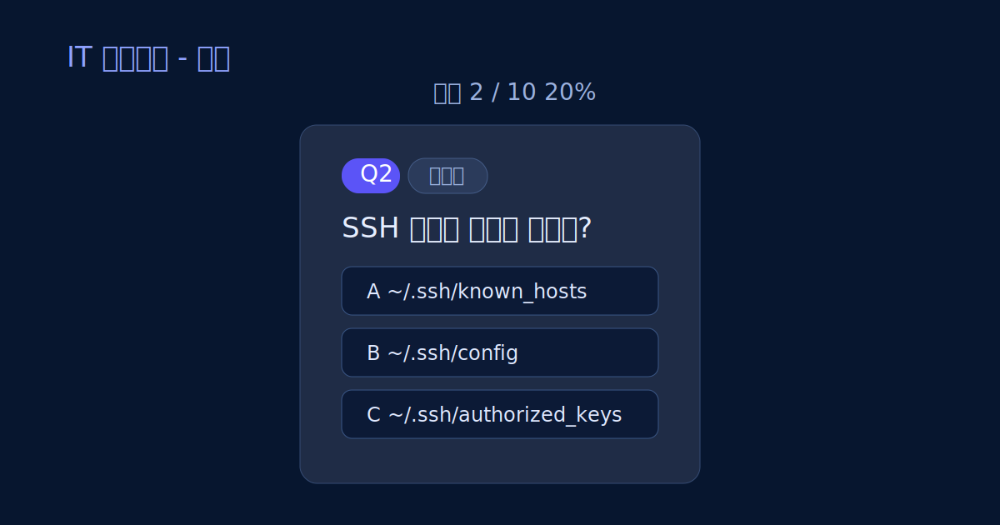
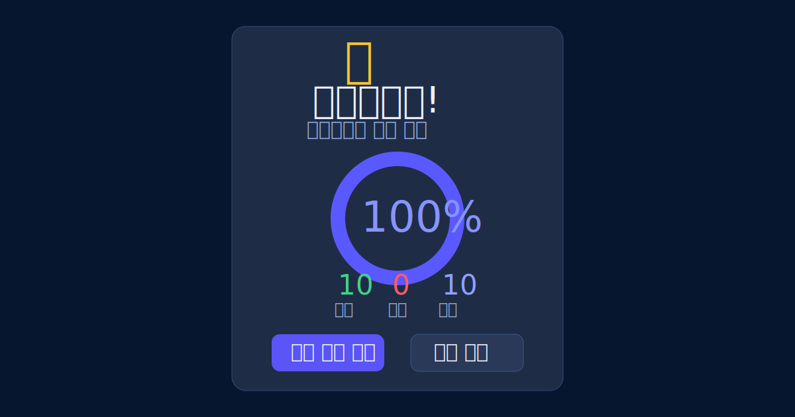
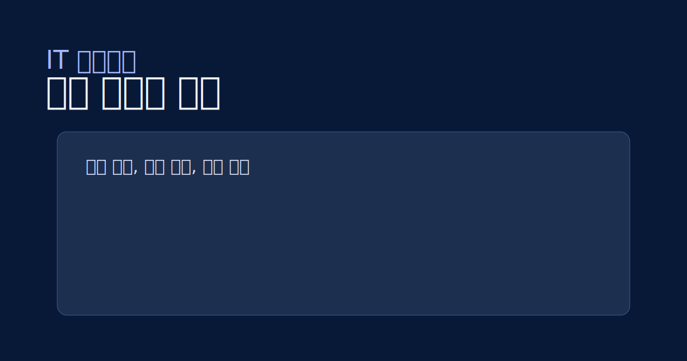
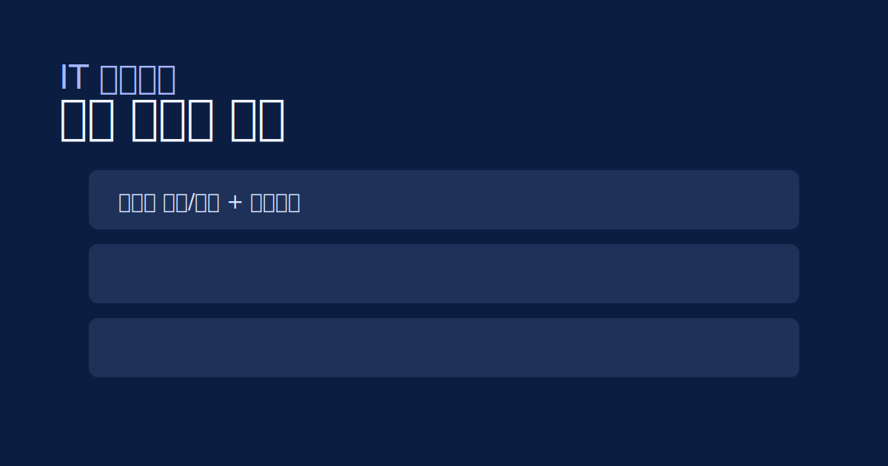

# IT-Qbank (IT 문제은행)

Flask + MySQL 기반의 IT 퀴즈 서비스입니다.  
카테고리별 객관식 문제를 AI(Gemini) + DB 하이브리드 방식으로 출제하고, 사용자별 이력과 상세 리뷰를 제공합니다.

## 핵심 기능
- 카테고리: `network`, `infra`, `linux`
- 문제 수 선택: `5 / 10 / 15 / 20`
- AI 우선 출제 + DB 보강: 부족 시 자동 생성/저장
- 사용자 최근 풀이 문제 해시(`question_hash`) 기반 중복 회피
- 한글 우선 문제 생성/표시
- 사용자별 시도 이력 저장 + 이력 항목별 다시보기

## 페이지 예시
- 메인(설정): 
- 퀴즈 진행: 
- 결과: 
- 오답/리뷰: 
- 이력: 

## 프로젝트 구조
```text
IT-Qbank/
├─ backend/
├─ frontend/
├─ db/
├─ docs/images/
├─ docker-compose.yml
├─ .env.example
├─ README.md
└─ QuickStartGuide.md
```

## 환경 변수
`.env.example`를 복사해 `.env`를 생성하세요.

주요 변수:
- `DB_HOST`, `DB_PORT`, `DB_NAME`, `DB_USER`, `DB_PASSWORD`
- `GEMINI_API_KEY`, `GEMINI_MODEL`, `GEMINI_API_URL`, `GEMINI_TIMEOUT`
- `USE_SQLITE_FALLBACK`
- `BACKEND_URL`, `FRONTEND_PROXY_TIMEOUT`
- `FLASK_DEBUG`

## 실행
```bash
docker compose up -d --build
```

접속:
- 프론트: `http://localhost:8080`
- 백엔드 헬스: `http://localhost:5000/api/health`

종료:
```bash
docker compose down
```

## 주요 API
- `GET /api/health`
- `GET /api/categories`
- `GET /api/questions/<category>?limit=10&shuffle=1&source=ai&user=<name>`
- `GET /api/questions/<category>/all`
- `POST /api/submit`
- `GET /api/history/<user_name>?limit=20`
- `GET /api/history/<user_name>/<attempt_id>`
- `GET /api/ai/health`
- `POST /api/ai/questions`

## DB 확인 (한글 깨짐 대응)
```bash
chcp 65001
mysql -h localhost -P 3306 -u quizuser -p --default-character-set=utf8mb4 quizdb
```

```sql
SET NAMES utf8mb4;
SELECT id, category, LEFT(question, 80) AS q, created_at
FROM questions
ORDER BY id DESC
LIMIT 10;
```

## 최근 반영 사항
- 사용자별 최근 풀이 문제 해시 제외 로직 적용
- 이력 페이지에서 선택한 시도를 리뷰 화면으로 재조회 가능
- `created_at` 컬럼 자동 보정 로직 추가
- KST 기준 시각 저장/응답(`created_at_kst`) 정리
